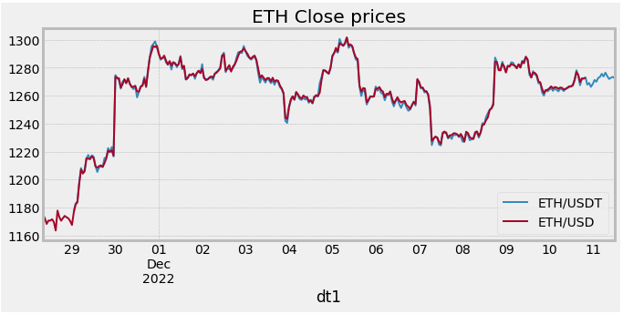
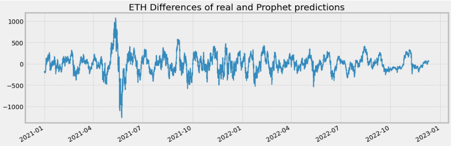
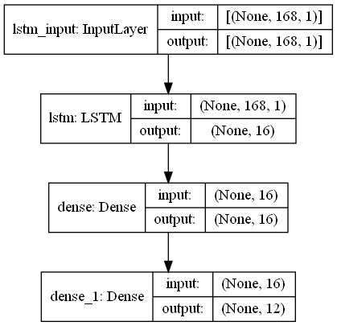
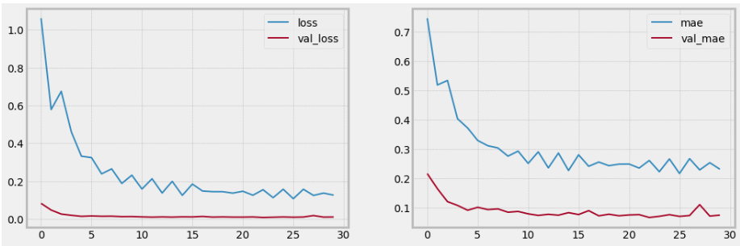
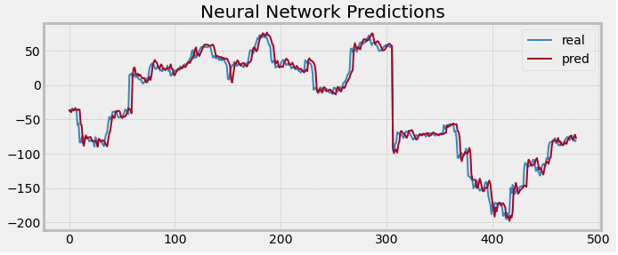
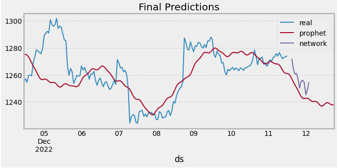
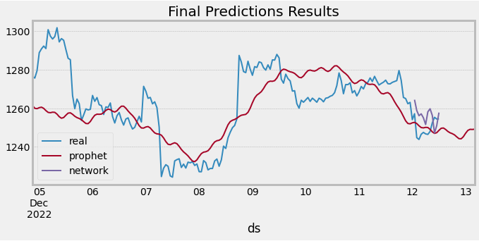
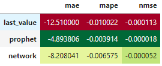

# Report of ETH Prediction Round 2

## 1. Input data
- We downloaded ETH/USD hourly prices data for the last 2 years from yfinance library.
- There are small differences in ETH/USD and ETH/USDT prices in but they are so insignificant that we can neglect them:

- This dataset we will use to train neural network model.

## 2. Data preprocessing for neural network training
- When deals with training neural networks we need to eliminate trend and seasonal components from the data. We have done it by applying Prophet model (https://facebook.github.io/prophet/) to the data and then substract predictions from the original dataset:

- Then we normalized these values to Z-scores.
- We set the task as the following: to predict future 12 hours based on one week of hourly data with the 2 hours of holdout period (the number of hours to the first prediction). 
- To create batches of tensors we have developed data generator outputting the tensors in the following shape: (batch_size, 24*7, 1). 

## 3. Neural network training
- We used the LSTM neural network with the following structure:

- The last 20 days were used as validation set.
- We used the batch_size = 512 for training, 30 epochs and 50 steps for epoch. The learning curve:

- We could reduce Mean Absolute Error from 63.36 to 7.61 by using neural network approach caomparing with Prophet model only. The validation set predictions looks like this:

## 4. Final predictions
- When we are doing the final predictions and send them to Ocean we are using fresh dataset from here: https://cexa.oceanprotocol.io/ohlc?exchange=binance&pair=ETH/USDT&period=1h 
- Then we are building Prophet model for these 1000 points and substract predictions from the real values and transform values to z-scores.
- Then we are doing predictions by the Neural network model.
- Then we are transforming predicted values in the inversed way (from z-score and add prophet predictions).
- The final predictions looks like this:

- Let's compare our predictions with the real values:

- The evaluation metrics of the final predictions:

- It was the case when prophet model looks better then neural network predictions.

