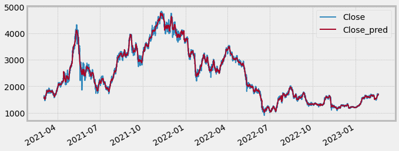
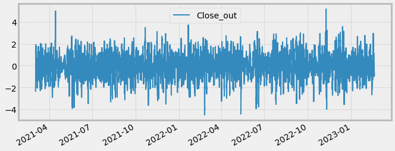
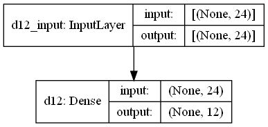
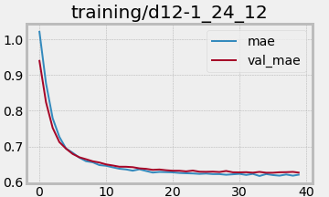
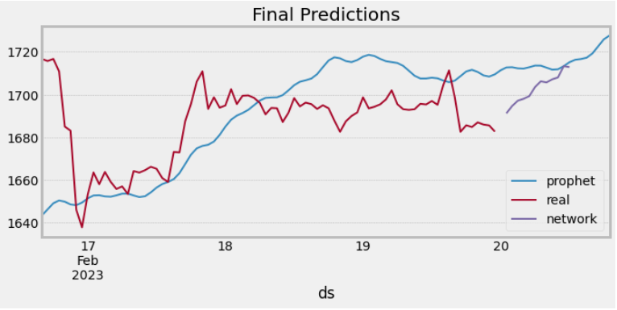
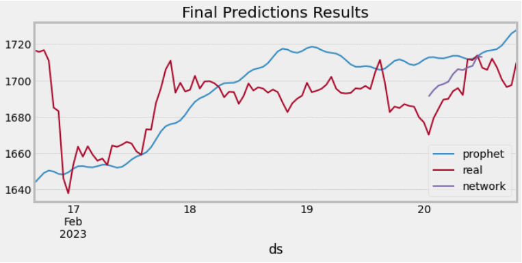
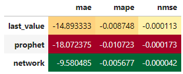

# Report of ETH Prediction Round 3

## 1. Input data
- We downloaded ETH/USD hourly prices data for the last 2 years from yfinance library.
- There are small differences in ETH/USD and ETH/USDT prices in but they are so insignificant that we neglected them.
- This dataset we have used for training different models.
- When we are doing the final predictions and send them to Ocean we are using the fresh dataset from here: https://cexa.oceanprotocol.io/ohlc?exchange=binance&pair=ETH/USDT&period=1h 

## 2. Data preprocessing for neural network training
When working with training neural networks we need to eliminate trend and seasonal components from the data. We have done it with using Prophet model (https://facebook.github.io/prophet/) the following way:
- Split our dataset into blocks with 1000 rows in each block
- Train Prophet models on them
- Create differences of real values and predictions and normalize them

Real and predicted values:

Normalized differences:

## 3. Neural network training
- We set this task the following way: to predict 12 hours of differences based on the previous 24*X hours with 1 hour of holdout period (the number of hours to the first prediction). 
- We choose X from 1,3,7,14 based on the results on the validation set.
- For validation set we have used the last available 1000 hours and made 12-hourly lists of predictions and then averaged them.
- We have focused on trainig simple neural networks consisting only from the Dense layers.
- After some experiments we decided to use the simplest model due to their simplicity and rather good quality:

- The learning curve of the best model looks good:

- We could reduce Mean Absolute Error from 18.99 to 10.20 by using this simple neural network (Comparing with Prophet model predictions). 

## 4. Final predictions

- We are building Prophet model for these last 1000 points and substract predictions from the real values and transform values to z-scores.
- Then we are doing predictions by the Neural network model.
- Then we are transforming predicted values in the inversed way (from z-score and add prophet predictions).
- The final predictions looks like this:

## 5. Results

- Let's compare our predictions with the real values:

- The evaluation metrics of the final predictions:

## 6. The ideas for future work
- To collect more data of ETH prices (5-10 years).
- To train different Recurrent Neural Networks models and understand if they can significantly bring addition quality.
- To train multioutput Random Forests or Boosting models on the preprocessed dataset.
